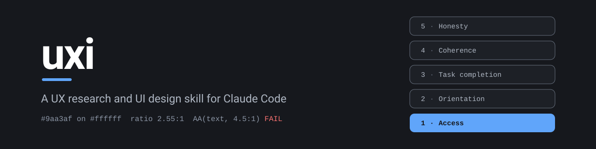

Ask it to put a countdown timer on your pricing page and it will say no, then show you what to build instead.

That is the part I care about most. uxi is a UX research and UI design skill for Claude Code, and it carries a floor: a short list of deceptive patterns that do not ship regardless of the projected conversion lift. The evals test that the skill holds that line under pressure, including when the prompt says legal signed off and the CEO wants it Friday. Point an optimizer at conversion alone and it will find manipulation by itself, without anyone ever sitting down to design the dark pattern. The floor is the guardrail against that.

The rest of it is a working procedure for designing interfaces and for checking whether they actually work, plus five plain-Python tools that measure instead of squint.

Most design guidance fails in one of two ways when an AI applies it. Either it gets applied everywhere the same, so a dense ops dashboard "fails" the same heuristics a landing page would, or it collapses into taste, where everything is a vibe and nothing is checkable. This skill is built against both. Every screen gets classified first (a checkout is not a radiology dashboard, and the rules that apply to one produce nonsense on the other), findings get reported bottom-up on a five-rung ladder so a broken keyboard path can never hide behind polish notes, and anything that exists as a file gets run through a linter rather than eyeballed.

## What is in here

The procedure itself lives in `skills/uxi/SKILL.md`. It is deliberately short. The depth sits in eight reference files the model reads only when the work needs them:

| File | Covers |
|---|---|
| `heuristics.md` | Nielsen's ten heuristics translated per surface class, behavioral laws, Gestalt grouping, interface writing |
| `laws-of-ux.md` | All thirty Laws of UX with origins, what to do with each, and how each gets misused in arguments |
| `accessibility.md` | WCAG 2.2 structure and numbers, per-platform target and type sizes, keyboard and screen reader procedure |
| `visual-craft.md` | Type scale, spacing, color, tokens, layout, density, elevation, motion, dark mode, state design, data viz |
| `research.md` | Method selection by question type, sample sizes, task writing, moderating, synthesis, metrics |
| `ethics.md` | The deceptive pattern catalog with severity and regulatory exposure, plus honest alternatives that still perform |
| `domain-playbooks.md` | What changes for ecommerce, SaaS admin, mobile, fintech, health, AI interfaces, dev tools, and more |
| `deliverables.md` | Templates for audits, design specs, research plans, test scripts, and decision records |

### The tools

Five scripts in `skills/uxi/scripts/`, all stdlib Python, no dependencies. Each exits 0 when clean, 1 when it found something, 2 when it could not run, so any of them can gate a CI step.

- `contrast_check.py` scores WCAG 2.2 contrast ratios for a pair, a token file, or a whole stylesheet.
- `a11y_lint.py` catches the mechanical accessibility failures a static parse can see, and is honest about the five common ones it cannot.
- `craft_lint.py` measures visual coherence: off-scale spacing, near-miss color drift, off-token values, dead focus rings, motion with no reduced-motion block.
- `research_stats.py` scores SUS with interpretation, puts Wilson intervals on small-sample completion rates, and reports every row it had to skip and why.
- `audit_report.py` validates audit findings as JSON and refuses to render a report that is missing evidence, fixes, or a surface class.

### The evals

`skills/uxi/evals/` holds twelve test prompts with `must` and `must_not` assertions, because most of the ways a skill like this fails are things it should not have said. Four carry deterministic blocks that grade without a judge. They run against real fixtures: a checkout page carrying six months of ordinary drift, a messy SUS export, a findings file that fails validation in nine named ways. The answer key in `assets/fixtures/ANSWERS.md` marks the judgment traps, which are tool outputs that are correct but are not defects. An answer that parrots every line of tool output fails the eval even though every line came from the tool.

```
cd skills/uxi
python3 evals/check.py
```

## Install

### As a Claude Code plugin

```
/plugin marketplace add ahammadnafiz/uxi
/plugin install uxi@uxi
```

### As a plain skill

Copy the skill folder into your skills directory, either per-user or per-project:

```
git clone https://github.com/ahammadnafiz/uxi.git
cp -r uxi/skills/uxi ~/.claude/skills/uxi        # every project
cp -r uxi/skills/uxi .claude/skills/uxi          # this project only
```

The folder is self-contained, so the same copy works with any agent runtime that reads `SKILL.md` files.

## Use

You do not invoke it so much as trip it. Ask Claude to review a screen, build a settings page, explain why signups are leaking, check whether something is accessible, or pick a research method, and the skill routes the request. A few shapes it handles well:

```
Review this checkout flow. The HTML and CSS are in src/.
Is this dashboard accessible?
Our signup drops 40% at step 3. Marketing wants to A/B test button colors. What should we actually do?
We're adding a countdown timer to the pricing page. Design it.
```

That last one may come back as a refusal with an alternative attached. That is the skill working.

The scripts also run standalone, no model involved:

```
python3 skills/uxi/scripts/contrast_check.py "#9aa3af" "#ffffff"
python3 skills/uxi/scripts/a11y_lint.py page.html
python3 skills/uxi/scripts/craft_lint.py styles.css --tokens tokens.json
```

## What it will not pretend

Heuristic evaluation finds problems, not solutions. A clean lint means no mechanical defects, never "accessible". Five users is a good argument for testing at all, not a coverage guarantee. The skill says these things out loud instead of rounding itself up to an authority, and a measured result from your own users beats any guideline in it.

## Sources

Written from public guidance and restated in its own words: Nielsen Norman Group's heuristics and research method work, WCAG 2.2, Apple's Human Interface Guidelines, Material 3, Jon Yablonski's Laws of UX, the GOV.UK design principles, and the deceptive pattern taxonomies of Harry Brignull and Gray et al. Go to the originals when a specific ruling matters.

## License

MIT
